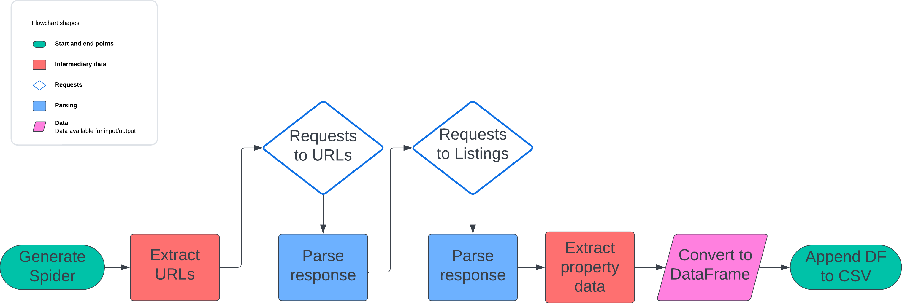

# Real Estate Data Scraper (Immospider)

## Table of Contents
1. [Overview](#overview)
2. [Installation](#installation)
3. [Usage](#usage)
4. [Flowchart](#flowchart)
5. [Support](#support)
6. [Contributing](#Contributing)
7. [License](#license)

## Overview

This Python script is designed to scrape real estate data from the immoweb.be website. It utilizes the Scrapy framework for web scraping and BeautifulSoup for parsing HTML content. The scraped data is then processed and saved into a CSV file using the pandas library.

The final dataset has following columns:

Property ID
Locality name
Postal code
Price
Type of property (house or apartment)
Subtype of property (bungalow, chalet, mansion, ...)
Type of sale (note: exclude life sales)
Number of rooms
Living area (area in m²)
Equipped kitchen (0/1)
Furnished (0/1)
Open fire (0/1)
Terrace (area in m² or null if no terrace)
Garden (area in m² or null if no garden)
Surface of good
Number of facades
Swimming pool (0/1)
State of building (new, to be renovated, ...)


## Installation

1. Clone the repository to your local machine: `git clone https://github.com/Nithyaraaj21/immo-eliza-scraping-FireFlies`
2. Ensure you have Python installed (version 3.10 or higher).
3. Install the required libraries by running:
    ```
    pip install -r requirements.txt
    ```

## Usage
1. Open a terminal or command prompt.
2. Navigate to the directory where the script is located.
3. Run the script:
 ```
   python main.py

 ```
4. The script will start scraping real estate data from immoweb.be and save it into a CSV file named `all_data.csv` in the same directory.


## Flowchart




## Support
If you encounter any issues or have any questions, please feel free to open an issue in this repository.

## Contributing

Contributions are welcome!

## License

The Wikipedia Scraper project is licensed under the [MIT License](./LICENSE.md).
